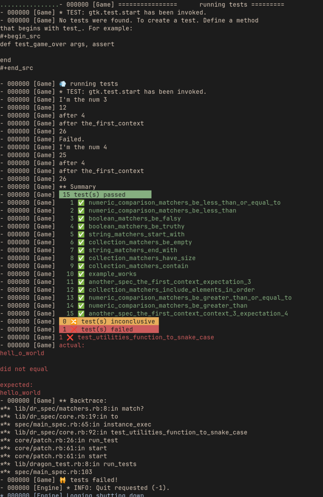

# Dr Spec

A simple DSL and test runner DragonRuby Game Toolkit (DRGTK).
It try to mimic rspec.

[New to writing tests? Check out this tutorial introducing the concept in DRGTK!](https://www.dragonriders.community/recipes/testing)

🚧 **dr_spec is a work in progress! It works, but the interfaces may change.** 🚧

# Install

1. copy `lib/dr_spec` folder into your dragon ruby projects
2. create or copy the `spec` folder
3. on your `app/main.rb` or `app/test.rb` file add `require "lib/dr_spec/dragon_specs.rb"` at the bottom of file

# Basic example

To describe your `spec` or `it` block you can use a :symbole or a "string" with any case or spaces.

```ruby
spec "Numeric Comparison matchers" do
  it "be greater than" do |args, assert|
    expect(10).to be_greater_than 5
  end
  it "be_greater_than_or_equal_to" do |args, assert|
    expect(10).to be_greater_than_or_equal_to 10
  end
  it "be_less_than" do |args, assert|
    expect(5).to be_less_than 10
  end
  it "be_less_than_or_equal_to" do |args, assert|
    expect(5).to be_less_than_or_equal_to 5
  end
end

# you can use symbol as spec and it desc
#
spec :boolean_matchers do
  it "be_truthy" do |args, assert|
    expect(true).to be_truthy
  end
  it :be_falsy do |args, assert|
    expect(false).to be_falsy
  end
end

# You can use context before and after block
#
context "context_3" do
  before do
    @b = 5
  end
  it "expectation_4" do |args, assert|
    puts "I'm the num 4"
    puts @a = @a * 5 + @b
    assert.equal! @a, 25, "nope 25"
  end
  after do |args, assert|
    @b = 6
    puts "after 4"
    @a = 4 * 5 + @b
    assert.equal! @a, 26, "nope 25"
  end
end

```

# Structure

1. spec
2. context
3. it
4. xit

it like rspec. If you want to use this lib it's maybe because you already know
rspec. If you want more doc please open an issue ;)

# Matchers

**!🚧 ! NOTE check the implementation file as the doc is not 100% align with matchers
names yet**

dr_spec try to replicate some commonly used standard matchers in RSpec:

## Equality

`eq`: Verifies that two values are equal.
<!--
`eql`: Verifies that two values are equal, taking type into account.
## Numeric Comparison:
-->

1. be >, be >=: Verifies that a value is greater (or greater or equal) than
another.
1. be <, be <=: Verifies that a value is less (or less or equal) than another.

## Boolean

1. be_truthy: Verifies that a value evaluates to true in a boolean context.
1. be_falsey: Verifies that a value evaluates to false in a boolean context.
1. `be_nil` Verifies that a value evaluates to nil.

## Type

1. be_a(type) or be_an(type): Verifies that the object is an instance of the
specified type.
1. be_instance_of(type): Verifies that the object is an exact instance of the
specified type.

## Collection Content

1. include(element): Verifies that an element is included in a collection.
1. match_array(array): Verifies that the collection is equivalent to the specified
array.

## String

1. start_with(string): Verifies that a string starts with the specified text.
1. end_with(string): Verifies that a string ends with the specified text.
1. include(string): Verifies that a string contains the specified text.


# Outputs

There is on this project a will to make a very fast and readable output




# Improve de doc

If you want to help on the doc of this project.
you can use grip to preview your markdown.

```
  pip install grip

```

```
  grip chemin/vers/votre/fichier.md

```


## Thanks

This project was strongly inspired by
https://github.com/DragonRidersUnite/dragon_test

See
https://github.com/kfischer-okarin/roguelike-tutorial-2021/tree/main/game/tests
and
https://github.com/kfischer-okarin/sludge-n-cinder/tree/main/game/tests
for good complement

This project is pretty new, so if you want to improve the doc or add other test
helper. Feel free to open an issue and make a PR it will be apreciate.

